N741 Homework 8
================
Melinda K. Higgins, PhD.
April 4, 2017

Homework 8 - DUE April 12, 2017 at 5pm
======================================

Please submit Homework 8 as a PDF to CANVAS no later than 5pm EST on April 12, 2017.

Wisconsin Breast Cancer Data (Original)
---------------------------------------

For Homework 8 you will be working with the "Original" Wisconsin Breast Cancer dataset from the UCI Machine Learning Repository; see UCI dataset <http://archive.ics.uci.edu/ml/datasets/Breast+Cancer+Wisconsin+%28Original%29>.

The raw data files can be downloaded from the associated Data Folder at <http://archive.ics.uci.edu/ml/machine-learning-databases/breast-cancer-wisconsin/>. In this homework you will be working with the "breast-cancer-wisconsin.data" dataset, which is a CSV comma delimited file with NO column names in the 1st row. The datafile description and associated column file names are in the "breast-cancer-wisconsin.names" which is a simple text file <http://archive.ics.uci.edu/ml/machine-learning-databases/breast-cancer-wisconsin/breast-cancer-wisconsin.names>. In this text file, as you read through it and scroll down, you'll see the following:

    7. Attribute Information: (class attribute has been moved to last column)

       #  Attribute                     Domain
       -- -----------------------------------------
       1. Sample code number            id number
       2. Clump Thickness               1 - 10
       3. Uniformity of Cell Size       1 - 10
       4. Uniformity of Cell Shape      1 - 10
       5. Marginal Adhesion             1 - 10
       6. Single Epithelial Cell Size   1 - 10
       7. Bare Nuclei                   1 - 10
       8. Bland Chromatin               1 - 10
       9. Normal Nucleoli               1 - 10
      10. Mitoses                       1 - 10
      11. Class:                        (2 for benign, 4 for malignant)

So, the final datafile will have 11 columns. The dataset itself is a compilation of multiple groups of clinical cases also detailed in the breast-cancer-wisconsin.names" file <http://archive.ics.uci.edu/ml/machine-learning-databases/breast-cancer-wisconsin/breast-cancer-wisconsin.names>.

The combined dataset has 699 cases (rows). However, 16 cases were missing values for the "Bare Nuclei" measurement. The R code below, processes the data, applies the names, and removes the cases with missing values. So, the final dataset created below `bcdat` will have 683 cases and 11 variables.

``` r
# from tidyverse - use readr
# to read in the comma delimited dataset
library(readr)

# raw data does not have column names
bcdat <- read_csv("breast-cancer-wisconsin.data",
                  col_names=FALSE)
```

    ## Parsed with column specification:
    ## cols(
    ##   X1 = col_integer(),
    ##   X2 = col_integer(),
    ##   X3 = col_integer(),
    ##   X4 = col_integer(),
    ##   X5 = col_integer(),
    ##   X6 = col_integer(),
    ##   X7 = col_integer(),
    ##   X8 = col_integer(),
    ##   X9 = col_integer(),
    ##   X10 = col_integer(),
    ##   X11 = col_integer()
    ## )

    ## Warning: 16 parsing failures.
    ## row col   expected actual
    ##  24  X7 an integer      ?
    ##  41  X7 an integer      ?
    ## 140  X7 an integer      ?
    ## 146  X7 an integer      ?
    ## 159  X7 an integer      ?
    ## ... ... .......... ......
    ## See problems(...) for more details.

``` r
# add variable names
names(bcdat) <- c("idnum","clumpthickness","uniformcellsize",
                  "uniformcellshape","marginaladhesion",
                  "singlecellsize","barenuclei","blandchromatin",
                  "normalnucleoli","mitoses","class")

# note in column 7 "Bare Nucleoli" there are
# question marks "?" that need to be set to missing NA
library(dplyr)
```

    ## 
    ## Attaching package: 'dplyr'

    ## The following objects are masked from 'package:stats':
    ## 
    ##     filter, lag

    ## The following objects are masked from 'package:base':
    ## 
    ##     intersect, setdiff, setequal, union

``` r
bcdat <- bcdat %>%
  mutate(barenucfix = ifelse(barenuclei=="?",NA,
                              as.numeric(barenuclei)))

# keep the main 11 variables
bcdat <- bcdat %>%
  select(idnum,clumpthickness,uniformcellsize,uniformcellshape,
         marginaladhesion,singlecellsize,barenucfix,blandchromatin,  
         normalnucleoli,mitoses,class)

# keep only complete cases, n=683
bcdat <- na.omit(bcdat)
```

Principal Components Analysis
-----------------------------

For this Homework, please refer back to the code and exercises that Dr. Hertzberg presented during lesson 10 - specifically review towards the end of "Lesson10Part3.Rmd" see <https://github.com/vhertzb/Lesson10/blob/master/Lesson10Part3.Rmd>. During this exercise, Dr. Hertzberg introduced you to the `prcomp` procedure for performing principal components analysis. `prcomp` is part of the built-in `stats` package with base R. To learn morn type `help(prcomp)`.

In Dr. Hertzberg's example, she provided code for:

-   performing the principal components analysis (pca)
-   using the pca output to make a plot of the variances for each principal component (pc)
-   computing the PVE (percent variance explained) and plotting the PVE
-   and plotting the principal component "scores" of the cases (e.g. the "scores" plot)

I will layout the code below for running the PCA for the dataset as a whole, which will include also making a "loadings" plot for the variable "coefficients" or "loading weights" for each PC - these "loading plots" give us additional insight into (a) how the variables cluster or relate/correlate with each other or not and (b) where they fall in terms of relevance for each PC in the plot. For this dataset, we can easily get away with keeping only 2 PCs and making simplier 2D scatterplots for both the "loading plot" and "scores plot".

Use the code steps below to help you complete this homework 8 assignment.

1. Perform the PCA
------------------

``` r
# use only columns 2 through 10
# you do not need the idnum, nor the class variables
pr.out <- prcomp(bcdat[,2:10], scale=TRUE)
summary(pr.out)
```

    ## Importance of components:
    ##                           PC1     PC2     PC3     PC4     PC5     PC6
    ## Standard deviation     2.4289 0.88088 0.73434 0.67796 0.61667 0.54943
    ## Proportion of Variance 0.6555 0.08622 0.05992 0.05107 0.04225 0.03354
    ## Cumulative Proportion  0.6555 0.74172 0.80163 0.85270 0.89496 0.92850
    ##                            PC7     PC8     PC9
    ## Standard deviation     0.54259 0.51062 0.29729
    ## Proportion of Variance 0.03271 0.02897 0.00982
    ## Cumulative Proportion  0.96121 0.99018 1.00000

2. Make plots of the variance and PVE
-------------------------------------

### Plot of the Variances of Each PC

``` r
plot(pr.out)
```

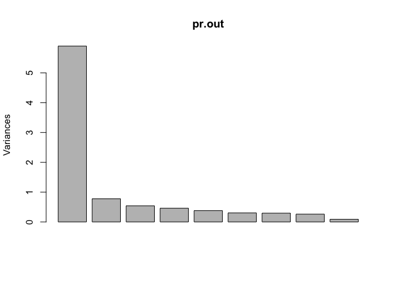

### Plot of the PVE and Cumulative PVE of each PC

``` r
# plots of the PVE percent variance explained
pve = 100*pr.out$sdev^2/sum(pr.out$sdev^2)
pve
```

    ## [1] 65.5499928  8.6216321  5.9916916  5.1069717  4.2252870  3.3541828
    ## [7]  3.2711413  2.8970651  0.9820358

``` r
plot(pve, type = "o", ylab = "Cumulative PVE", xlab = "Principal Component", col="blue")
```

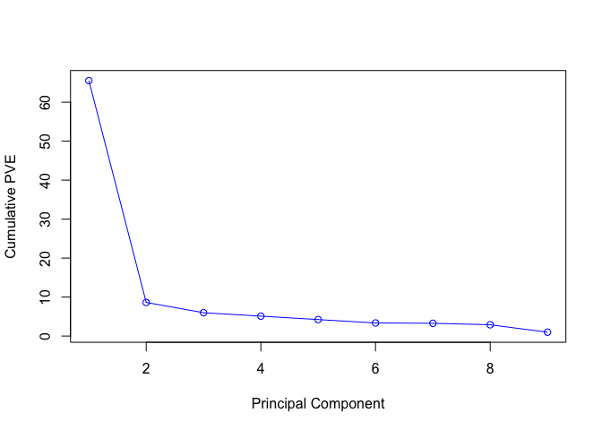

``` r
plot(cumsum(pve), type = "o", ylab = "Cumulative PVE", xlab = "Principal Component", col="brown3")
```

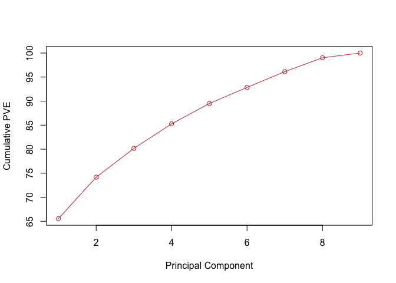

3. Make a "loadings plot" of the variables
------------------------------------------

``` r
# loadings are in the "rotation" part of the 
# pr.out list object. "rotation" is a matrix
# with a row for each variable and a column for
# each PC.
pr.out$rotation
```

    ##                         PC1         PC2          PC3         PC4
    ## clumpthickness   -0.3020626 -0.14080053  0.866372452 -0.10782844
    ## uniformcellsize  -0.3807930 -0.04664031 -0.019937801  0.20425540
    ## uniformcellshape -0.3775825 -0.08242247  0.033510871  0.17586560
    ## marginaladhesion -0.3327236 -0.05209438 -0.412647341 -0.49317257
    ## singlecellsize   -0.3362340  0.16440439 -0.087742529  0.42738358
    ## barenucfix       -0.3350675 -0.26126062  0.000691478 -0.49861767
    ## blandchromatin   -0.3457474 -0.22807676 -0.213071845 -0.01304734
    ## normalnucleoli   -0.3355914  0.03396582 -0.134248356  0.41711347
    ## mitoses          -0.2302064  0.90555729  0.080492170 -0.25898781
    ##                          PC5         PC6          PC7         PC8
    ## clumpthickness    0.08032124 -0.24251752 -0.008515668  0.24770729
    ## uniformcellsize  -0.14565287 -0.13903168 -0.205434260 -0.43629981
    ## uniformcellshape -0.10839155 -0.07452713 -0.127209198 -0.58272674
    ## marginaladhesion -0.01956898 -0.65462877  0.123830400  0.16343403
    ## singlecellsize   -0.63669325  0.06930891  0.211018210  0.45866910
    ## barenucfix       -0.12477294  0.60922054  0.402790095 -0.12665288
    ## blandchromatin    0.22766572  0.29889733 -0.700417365  0.38371888
    ## normalnucleoli    0.69021015  0.02151820  0.459782742  0.07401187
    ## mitoses           0.10504168  0.14834515 -0.132116994 -0.05353693
    ##                           PC9
    ## clumpthickness   -0.002747438
    ## uniformcellsize  -0.733210938
    ## uniformcellshape  0.667480798
    ## marginaladhesion  0.046019211
    ## singlecellsize    0.066890623
    ## barenucfix       -0.076510293
    ## blandchromatin    0.062241047
    ## normalnucleoli   -0.022078692
    ## mitoses           0.007496101

``` r
# choose the 1st and 2nd columns for the 1st 2 PCs
# and plot these loading weights for the 9
# variables. I tweaked the limits some
# feel free to change these as needed
plot(pr.out$rotation[,1],pr.out$rotation[,2],
     xlim=c(-0.5,0.1),ylim=c(-0.5,1),
     cex=2, pch=19,
     xlab = "Principal Component 1",
     ylab = "Principal Component 2",
     main = "Loadings Plot for PC 1 and 2")

# add xpd=FALSE to prevent lines drawn outside plot area
par(xpd=FALSE)

# add red dashed lines for the axes at y=0 and x=0
abline(h=0, col="red")
abline(v=0, col="red")

# overlay the variable names on this loading plot
text(pr.out$rotation[,1],pr.out$rotation[,2],
     labels = rownames(pr.out$rotation),
     pos = 3)
```

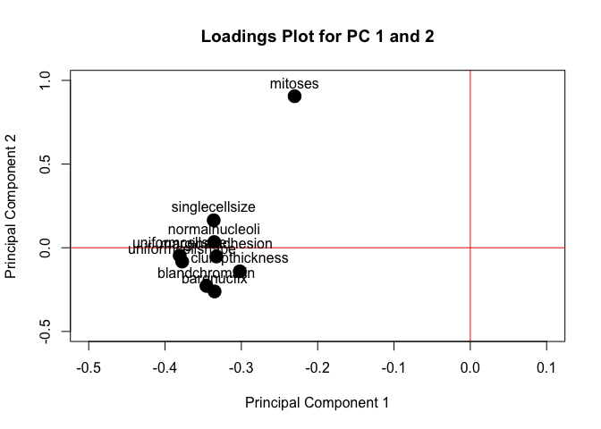

4. Scores Plot on 1st 2 PCs
---------------------------

``` r
# scores plot - use x from the pr.out list object
# plot scores on 1st 2 PCs, columns 1 and 2 of x
# color the points by the "class" variable for
# benign (class=2) or malignant (class=4)
plot(pr.out$x[,1],pr.out$x[,2], 
     col = bcdat$class,
     xlab = "Principal Component 1",
     ylab = "Principal Component 2",
     main = "Scores Plot on PC 1 and 2",
     sub = "Blue=Benign (class=2) and Red=Malignant (class=4)")
```

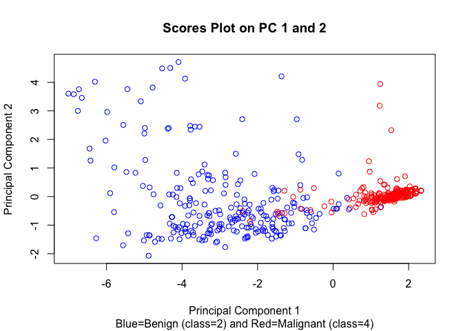

Homework 8 Tasks
----------------

1.  Rerun the PCA (steps 1-4 above) for (A) just the Benign cases and for just the (B) Malignant Cases. The code below, sets up these data subsets for you.

``` r
# Benign cases
bcdatBenign <- bcdat %>%
  filter(class == 2)

# Malignant cases
bcdatMalignant <- bcdat %>%
  filter(class == 4)
```

*HINT: simply rename the new subsets and run the code steps above.*

``` r
# redo for benign ==============
bcdat <- bcdatBenign
# run steps above

# redo for malignant ==================
bcdat <- bcdatMalignant
```

############################################### 

1. Benign, PCA
--------------

``` r
pr.out <- prcomp(bcdatBenign[,2:10], scale=TRUE)
summary(pr.out)
```

    ## Importance of components:
    ##                           PC1    PC2    PC3     PC4     PC5     PC6
    ## Standard deviation     1.7887 1.0405 0.9930 0.92684 0.91865 0.85577
    ## Proportion of Variance 0.3555 0.1203 0.1096 0.09545 0.09377 0.08137
    ## Cumulative Proportion  0.3555 0.4758 0.5854 0.68081 0.77458 0.85595
    ##                            PC7     PC8     PC9
    ## Standard deviation     0.72971 0.69343 0.53208
    ## Proportion of Variance 0.05916 0.05343 0.03146
    ## Cumulative Proportion  0.91512 0.96854 1.00000

2. Benign, plots of the variance and PVE
----------------------------------------

### Plot of the Variances of Each PC

``` r
plot(pr.out)
```

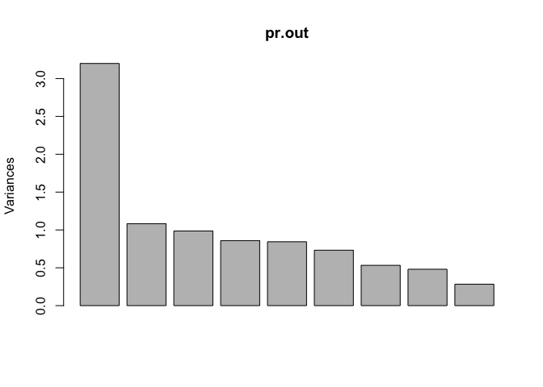

### Benign, plot of the PVE and Cumulative PVE of each PC

``` r
pve = 100*pr.out$sdev^2/sum(pr.out$sdev^2)
pve
```

    ## [1] 35.550174 12.029083 10.957095  9.544841  9.376951  8.137200  5.916378
    ## [8]  5.342677  3.145601

``` r
plot(pve, type = "o", ylab = "Cumulative PVE", xlab = "Principal Component", col="blue")
```

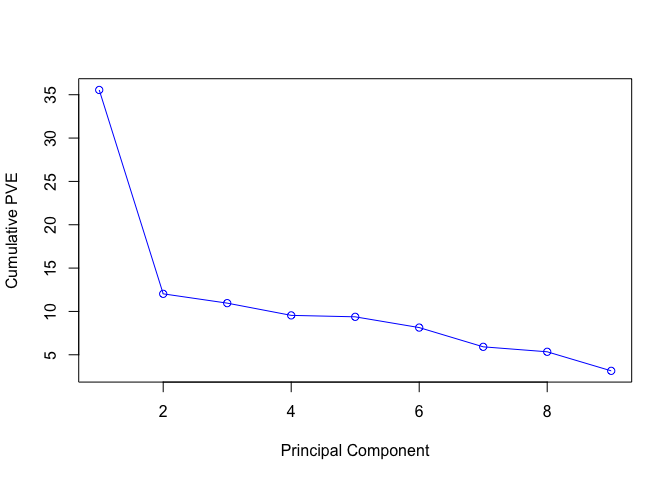

``` r
plot(cumsum(pve), type = "o", ylab = "Cumulative PVE", xlab = "Principal Component", col="brown3")
```

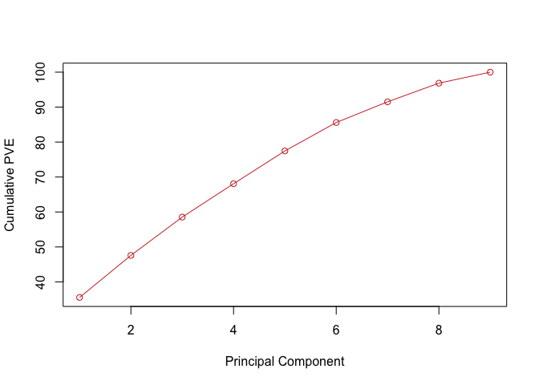

3. Benign, "loadings plot" of the variables
-------------------------------------------

``` r
pr.out$rotation
```

    ##                          PC1          PC2         PC3          PC4
    ## clumpthickness   -0.24011520 -0.253256825  0.62484649 -0.199323941
    ## uniformcellsize  -0.45864830 -0.033204671 -0.02085097 -0.330649289
    ## uniformcellshape -0.41582963 -0.112167262  0.09869789 -0.447953433
    ## marginaladhesion -0.29961721  0.231565724  0.37743125  0.606952624
    ## singlecellsize   -0.35673183 -0.007389172 -0.04352450  0.279971872
    ## barenucfix       -0.36072777  0.311655317 -0.05724935  0.250068883
    ## blandchromatin   -0.23796491 -0.270255849 -0.60100673  0.128887383
    ## normalnucleoli   -0.39235641 -0.058082399 -0.28511559 -0.009877498
    ## mitoses          -0.03672453  0.833641905 -0.09625297 -0.352503945
    ##                          PC5        PC6         PC7         PC8
    ## clumpthickness    0.51477010 -0.1751030  0.38404427  0.06874853
    ## uniformcellsize  -0.18213500  0.1864954 -0.13495407 -0.04930335
    ## uniformcellshape -0.21954352  0.2370728 -0.26160782 -0.23353820
    ## marginaladhesion  0.19804701  0.1093704 -0.52767057 -0.12507351
    ## singlecellsize   -0.38970577 -0.5702306  0.33220762 -0.45240165
    ## barenucfix       -0.13507321  0.4982717  0.55467287  0.34056137
    ## blandchromatin    0.58710974  0.1690343  0.06913716 -0.33732847
    ## normalnucleoli    0.07300474 -0.4678173 -0.25315695  0.67741729
    ## mitoses           0.30704026 -0.2133771  0.02302674 -0.17124652
    ##                          PC9
    ## clumpthickness   -0.01329810
    ## uniformcellsize  -0.76823067
    ## uniformcellshape  0.61377445
    ## marginaladhesion -0.02229120
    ## singlecellsize    0.01861508
    ## barenucfix        0.12950293
    ## blandchromatin    0.02593358
    ## normalnucleoli    0.11886569
    ## mitoses           0.02257633

``` r
plot(pr.out$rotation[,1],pr.out$rotation[,2],
     xlim=c(-0.5,0.1),ylim=c(-0.5,1),
     cex=2, pch=19,
     xlab = "Principal Component 1",
     ylab = "Principal Component 2",
     main = "Loadings Plot for PC 1 and 2")
par(xpd=FALSE)
abline(h=0, col="red")
abline(v=0, col="red")
text(pr.out$rotation[,1],pr.out$rotation[,2],
     labels = rownames(pr.out$rotation),
     pos = 3)
```

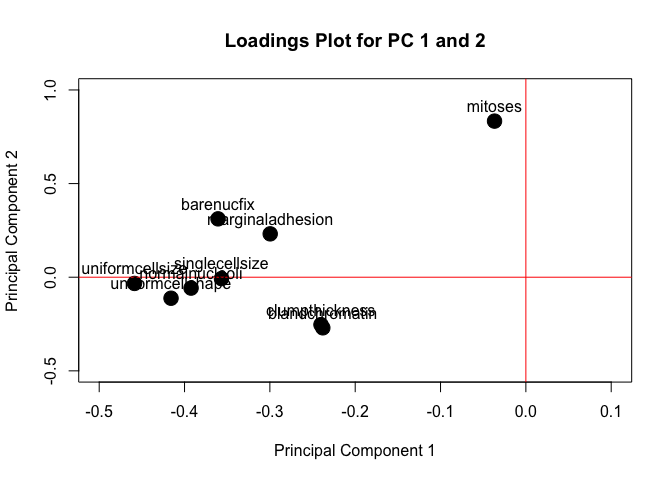

4. Benign, plot on 1st 2 PCs
----------------------------

``` r
plot(pr.out$x[,1],pr.out$x[,2], 
     col = bcdatBenign$class,
     xlab = "Principal Component 1",
     ylab = "Principal Component 2",
     main = "Scores Plot on PC 1 and 2")
```

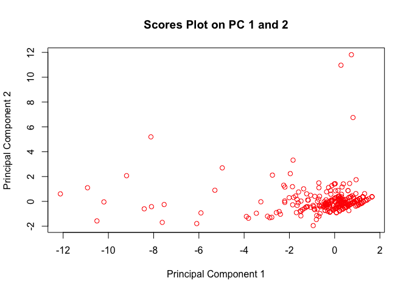

1. Malignant, PCA
-----------------

``` r
pr.out <- prcomp(bcdatMalignant[,2:10], scale=TRUE)
summary(pr.out)
```

    ## Importance of components:
    ##                           PC1    PC2    PC3    PC4    PC5     PC6     PC7
    ## Standard deviation     1.6881 1.1405 1.0114 0.9710 0.8955 0.82523 0.79132
    ## Proportion of Variance 0.3166 0.1445 0.1137 0.1048 0.0891 0.07567 0.06958
    ## Cumulative Proportion  0.3166 0.4611 0.5748 0.6795 0.7687 0.84432 0.91389
    ##                           PC8    PC9
    ## Standard deviation     0.7181 0.5092
    ## Proportion of Variance 0.0573 0.0288
    ## Cumulative Proportion  0.9712 1.0000

2. Benign, plots of the variance and PVE
----------------------------------------

### Plot of the Variances of Each PC

``` r
plot(pr.out)
```

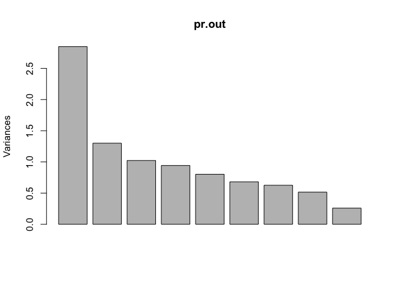

### Benign, plot of the PVE and Cumulative PVE of each PC

``` r
pve = 100*pr.out$sdev^2/sum(pr.out$sdev^2)
pve
```

    ## [1] 31.661845 14.452164 11.364996 10.475550  8.910443  7.566671  6.957691
    ## [8]  5.730245  2.880396

``` r
plot(pve, type = "o", ylab = "Cumulative PVE", xlab = "Principal Component", col="blue")
```

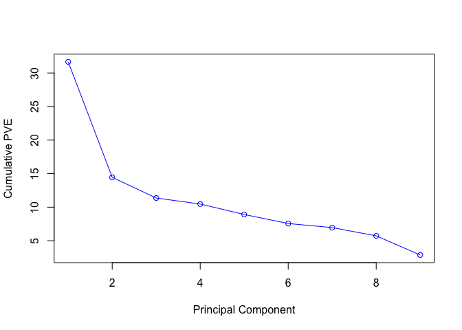

``` r
plot(cumsum(pve), type = "o", ylab = "Cumulative PVE", xlab = "Principal Component", col="brown3")
```

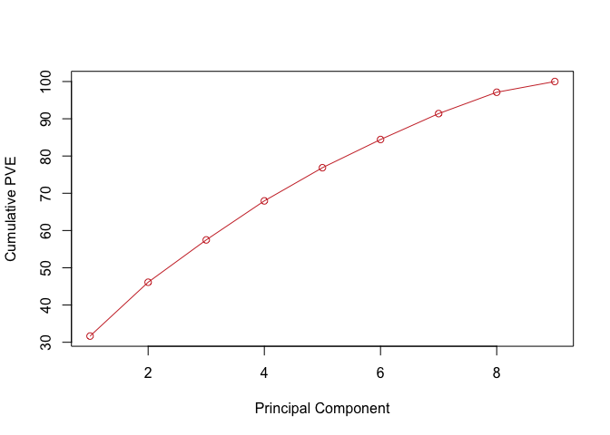

3. Benign, "loadings plot" of the variables
-------------------------------------------

``` r
pr.out$rotation
```

    ##                          PC1         PC2         PC3         PC4
    ## clumpthickness   -0.04423311  0.47453175 -0.72050432  0.03375094
    ## uniformcellsize  -0.49200997  0.09144594 -0.10713144 -0.23385625
    ## uniformcellshape -0.46669310  0.06386848 -0.19774730 -0.24213467
    ## marginaladhesion -0.31654337 -0.44402770  0.10728697  0.25657447
    ## singlecellsize   -0.38065450  0.18190583  0.12106578  0.20864693
    ## barenucfix       -0.03443192 -0.57557062 -0.49808880  0.35266296
    ## blandchromatin   -0.34513808 -0.32908090 -0.09767689 -0.30475120
    ## normalnucleoli   -0.31497084  0.09772667  0.36209294 -0.12934244
    ## mitoses          -0.27121420  0.28809974  0.12401793  0.73634571
    ##                          PC5         PC6         PC7         PC8
    ## clumpthickness   -0.33747692  0.19363953  0.06219100  0.31186804
    ## uniformcellsize   0.25878373  0.05030229 -0.22115522 -0.11677498
    ## uniformcellshape  0.20325032 -0.13515456 -0.40047847 -0.22875166
    ## marginaladhesion -0.08457519  0.56327695 -0.28239595  0.46360581
    ## singlecellsize    0.44399919 -0.28036154  0.49840771  0.47849939
    ## barenucfix       -0.04647075 -0.52478456 -0.04208568 -0.03054114
    ## blandchromatin   -0.26382710  0.24258816  0.66277346 -0.31133678
    ## normalnucleoli   -0.69424240 -0.44416638 -0.13065490  0.20939361
    ## mitoses          -0.14072880  0.11954714  0.02390310 -0.50117220
    ##                           PC9
    ## clumpthickness    0.009006567
    ## uniformcellsize  -0.742531194
    ## uniformcellshape  0.638825011
    ## marginaladhesion  0.078657744
    ## singlecellsize    0.103499670
    ## barenucfix       -0.121683838
    ## blandchromatin    0.074285922
    ## normalnucleoli   -0.056828116
    ## mitoses          -0.003860273

``` r
plot(pr.out$rotation[,1],pr.out$rotation[,2],
     xlim=c(-0.5,0.1),ylim=c(-0.5,1),
     cex=2, pch=19,
     xlab = "Principal Component 1",
     ylab = "Principal Component 2",
     main = "Loadings Plot for PC 1 and 2")
par(xpd=FALSE)
abline(h=0, col="red")
abline(v=0, col="red")
text(pr.out$rotation[,1],pr.out$rotation[,2],
     labels = rownames(pr.out$rotation),
     pos = 3)
```

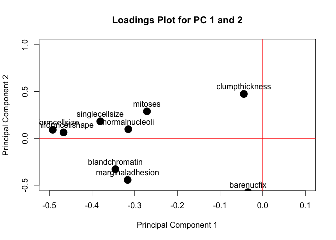

4. Benign, plot on 1st 2 PCs
----------------------------

``` r
plot(pr.out$x[,1],pr.out$x[,2], 
     col = bcdatMalignant$class,
     xlab = "Principal Component 1",
     ylab = "Principal Component 2",
     main = "Scores Plot on PC 1 and 2")
```


1.  In the overall dataset, when looking at the loadings plot, which variables cluster together? which variables do not lie with that cluster?

2.  How do the variable clusters seen in the loading plots for the Benign data subset and Malignant subset differ? and how are they similar if at all?

3.  Is using 2 principal components reasonable for summarizing the variability seen in this Breast Cancer dataset with 9 measurements? Explain your reasoning for (a) the overall dataset, (b) the Benign subset and (c) the Malignant subset

4.  While PCA is an unsupervised data analysis method (i.e. no "target" class information is used in the analysis), do you think the 2 PCs extracted do a good job of helping to distinguish Benign cases from Malignant cases (i.e. look back at the overall dataset Scores Plot). Explain your rationale.

5.  Please save your RMD to a Github repository. Submit the PDF report for Homework 8 to CANVAS and include a link to your Homework 8 Github Repository.
